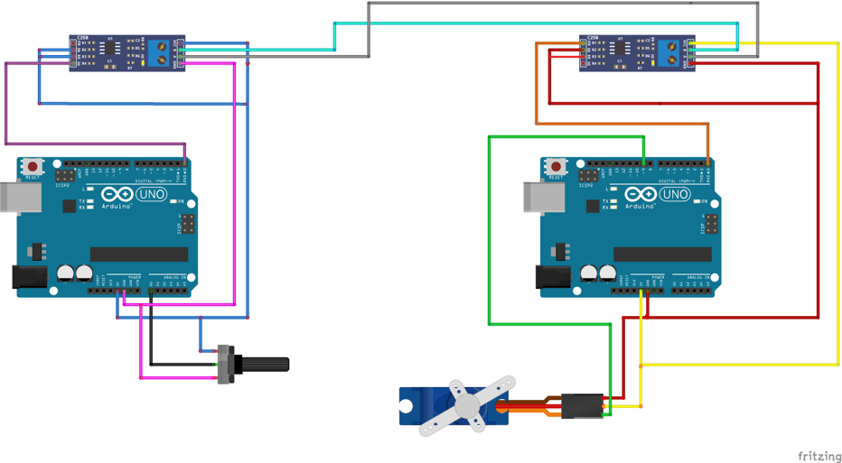
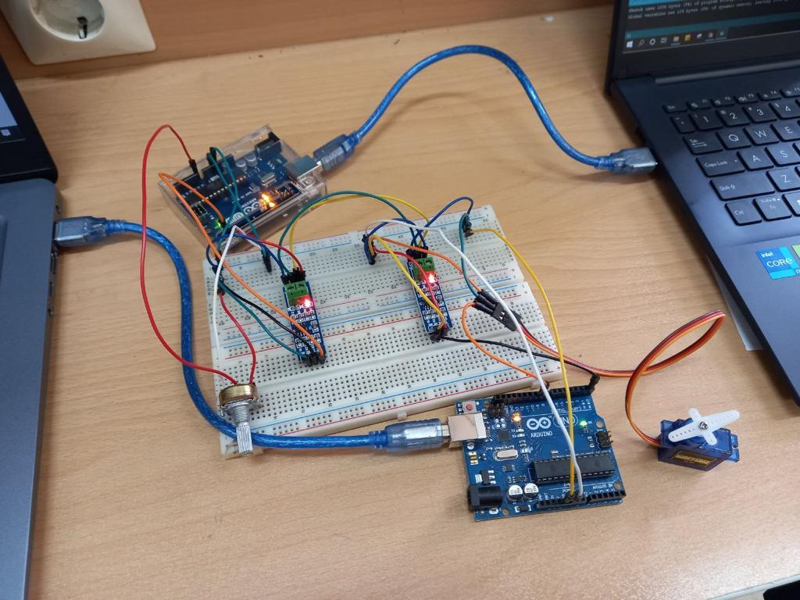
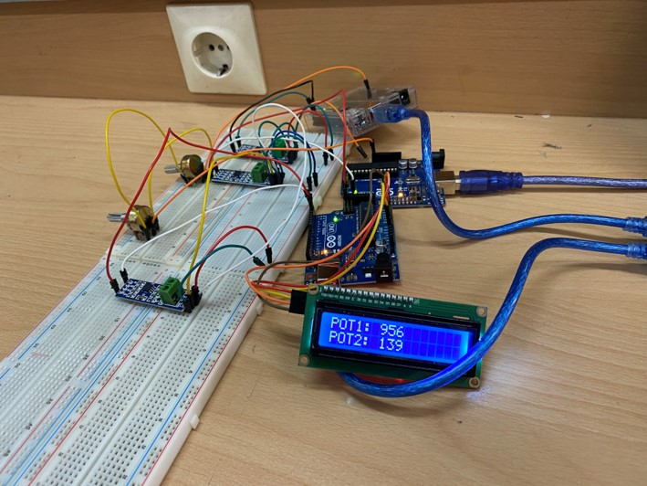

# Arduino-Modbus-RS485

### Getting Started
To use these sketches, you will need the following components:

- An Arduino board with I2C interface (We used Arduino Uno)
- A 16x2 LCD display with I2C interface 
- MAX485 TTL- RS485
- Potentiometer 
- Servo Motor

## Project 1: 
This Arduino project controls the position of a servo motor using a potentiometer. The project uses the Serial communication protocol for sending the position of the servo motor from the transmitter Arduino board to the receiver Arduino board.

### Instructions
- Connect the potentiometer to the transmitter Arduino board.
- Connect the servo motor to the receiver Arduino board.
- Connect the two Arduino boards using the Serial communication protocol.
- Upload the code to the transmitter and receiver Arduino boards.
- Rotate the potentiometer to change the position of the servo motor.

#### Wiring diagram:
The following wiring diagram displays the connections between the various components used in the project:

### How It Works
The transmitter code reads the value of the potentiometer using the 'analogRead' function then scales the value to an angle between 0 and 180. Finally, it sends the angle to the receiver Arduino board through the Serial communication protocol.
The receiver code listens for data on the Serial communication protocol. It reads the angle sent by the transmitter Arduino board using the 'Serial.read' function. It then sets the position of the servo motor to the corresponding angle using the 'myservo.write' function.

## Project 2: 
This sketch demonstrates how to display sensor readings on a 16x2 LCD display connected to an Arduino board using I2C interface. The sensor readings are received through a serial port from a connected device, and are displayed on the LCD screen. The sketch uses the LiquidCrystal_I2C library to control the LCD display.

### Instructions
To set up the hardware, connect the I2C pins of the LCD display to the corresponding pins on the Arduino board. Connect the LED pin of the LCD display to a digital output pin on the Arduino board, and connect the Enable pin of the LCD display to another digital output pin on the Arduino board.
Upload the sketch to the Arduino board using the Arduino IDE. 

### How It Works
The sketch initializes the LCD display and sets up two digital output pins for the LED and Enable signals. It then enters an infinite loop, where it listens for incoming serial data from the connected device.
When a valid data packet is received, the sketch parses it to extract the slave ID and sensor reading value. If the slave ID matches the expected value (1 or 2), the sketch updates the LCD display with the corresponding sensor reading value.
Finally, the sketch toggles the Enable pin to enable or disable communication with the connected device.
Note that the sketch expects incoming data to be in a specific format, and may not work with different protocol.

### Customization
To customize this sketch for your own use, you can modify the following:
- The I2C address and dimensions of the LCD display, which are defined in the LiquidCrystal_I2C constructor
- The digital output pins used for the LED and Enable signals, which are defined as constants at the beginning of the sketch
- The serial communication protocol used by the connected device, which is currently hardcoded in the sketch

## Contributors
- [Kiana Hooshanfar](https://www.github.com/K-Hooshanfar)
- [Mahsa Kalam](https://www.github.com/klammhsa)

